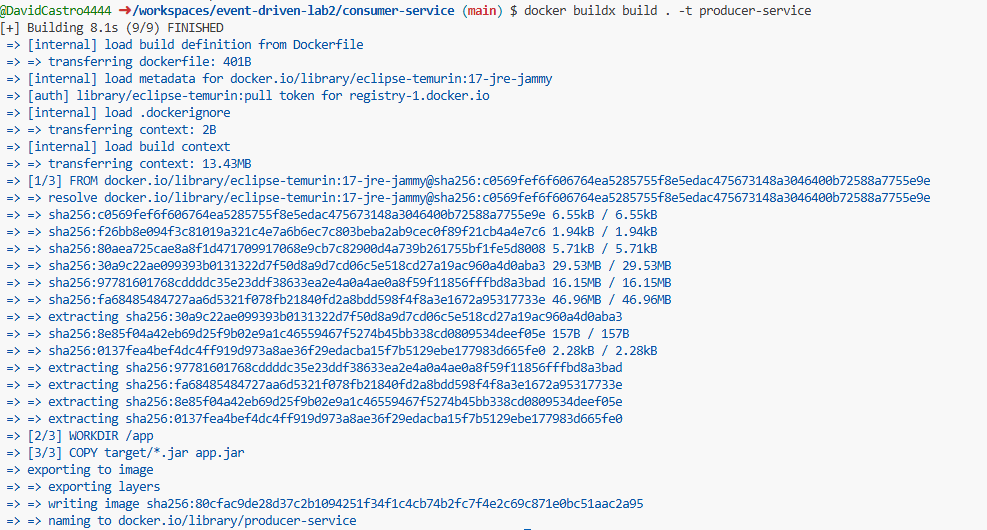

# event-driven-lab2### ARCN - Arquitectura centrada en el negocio

#  Taller Event Driven

 El objetivo fue construir dos aplicaciones Spring Boot: un servicio productor que envía mensajes y un servicio consumidor que los recibe, utilizando RabbitMQ como sistema de mensajería. Ambos servicios se ejecutan en contenedores Docker y están orquestados mediante Docker Compose, lo cual facilita su despliegue en entornos como Play with Docker. Además, configuramos GitHub Codespaces como entorno de desarrollo remoto para trabajar fácilmente desde cualquier lugar. Esta experiencia me permitió comprender cómo se integran tecnologías como Spring Boot, RabbitMQ y Docker para construir sistemas distribuidos modernos.

## Desarrollo del laboratorio

### Creación de contenedores Docker

- **PRODUCER**
```dockerfile
# producer-service/Dockerfile
# Usa una imagen base de JRE ligera que coincida con tu JDK de compilación
FROM openjdk:17-jdk-slim

# Argumento para el JAR (se pasa durante la construcción en docker-compose)
ARG JAR_FILE=target/*.jar

# Establece el directorio de trabajo
WORKDIR /app

# Copia el JAR construido a la imagen
COPY ${JAR_FILE} app.jar

# Expone el puerto de la aplicación
EXPOSE 8080

# Comando para ejecutar la aplicación
ENTRYPOINT ["java", "-jar", "app.jar"]
```




- **CONSUMER**
```dockerfile
# consumer-service/Dockerfile
# Usa una imagen base de JRE ligera
FROM eclipse-temurin:17-jre-jammy

# Argumento para el JAR
ARG JAR_FILE=target/*.jar

# Directorio de trabajo
WORKDIR /app

# Copia el JAR
COPY ${JAR_FILE} app.jar

# No necesita exponer puerto si solo consume mensajes
# EXPOSE 8081

# Comando de ejecución
ENTRYPOINT ["java", "-jar", "app.jar"]
```


### Despliegue con Play with docker
Creamos el archivo docker-compose.yml


Iniciamos los contenedores


Publicamos un mensaje desde el GUI de RabbitMQ y verificamos los logs del contenedor de consumer


Publicamos un mensaje desde la máquina personal y verificamos los logs del contenedor de publisher y consumer.


